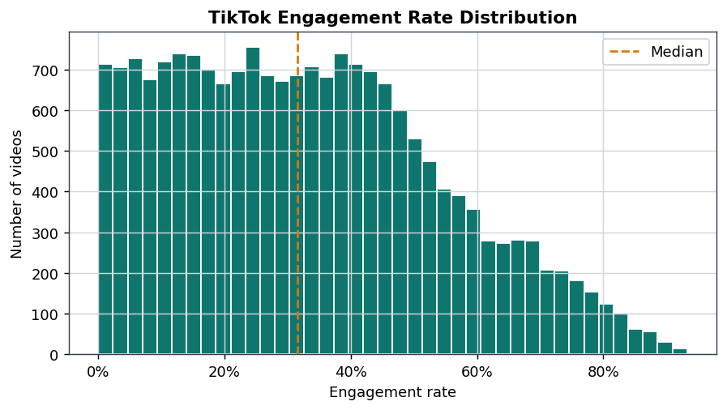
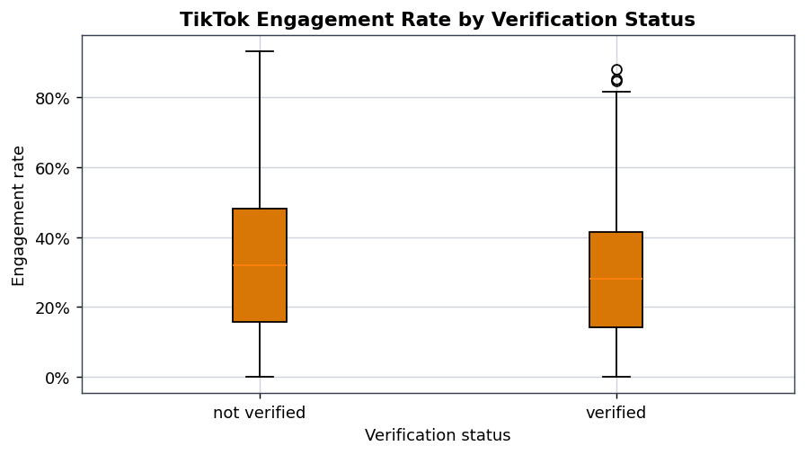
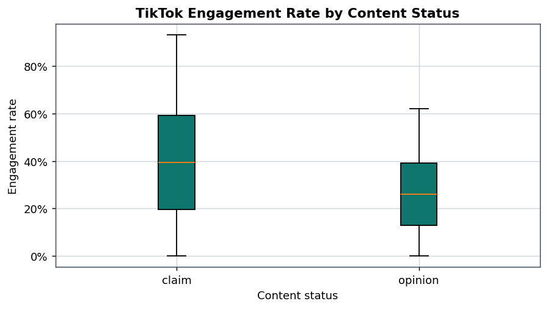
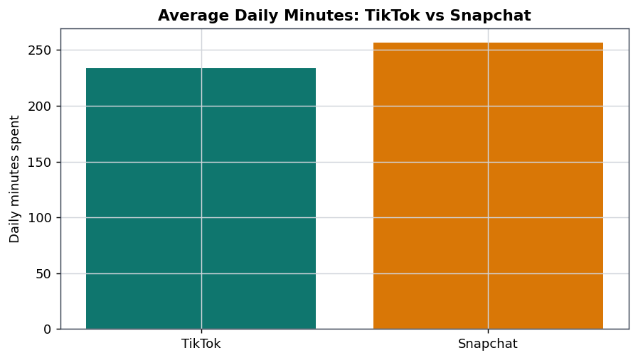
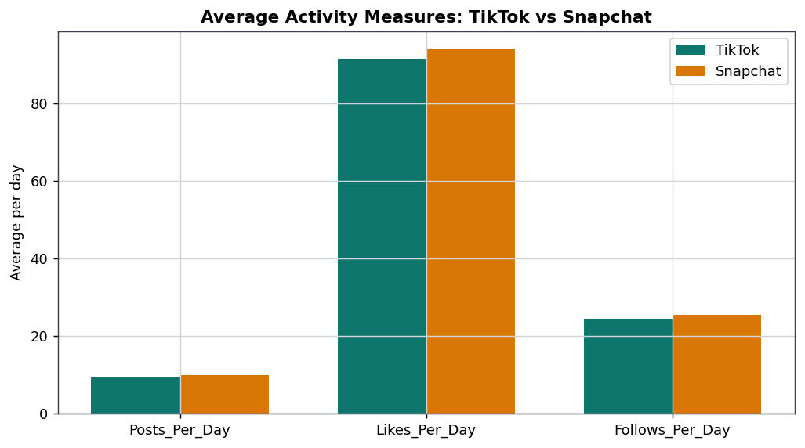

# A Comparative Analysis of TikTok and Snapchat

## Executive Summary

This report evaluates TikTok and Snapchat as digital business platforms using the two datasets included in the project folder (`tiktok_dataset.csv`; `social_media_usage.csv`). TikTok is analyzed mainly through video-level engagement data, while the TikTok-Snapchat comparison is limited to shared usage measures.

The cleaned TikTok dataset contains **19,084 videos**. Average TikTok engagement rate is **33.19%**, with a median of **31.57%**. The comparison sample contains **297 TikTok and Snapchat observations** after filtering the usage dataset to the two platforms studied. In this sample, Snapchat has slightly higher average daily minutes, likes, posts, and follows, but **0 of 4** Welch t-tests are statistically significant at alpha = 0.05.

The earlier regression-style interpretation has been removed because likes, shares, comments, and views define engagement rate. Presenting those same variables as independent drivers would create target leakage. The corrected analysis compares engagement rate across genuinely independent TikTok fields: claim/opinion status, verification status, author ban status, video duration, and download rate.

## 1. Research Question and Business Context

The research question asks how TikTok and Snapchat differ as data-driven digital businesses. TikTok is framed primarily as an algorithmic content discovery platform: user responses to videos can strengthen personalization, creator feedback, and advertising inventory. Snapchat is framed primarily as a communication platform supported by friend networks and augmented reality features. This distinction is important because both platforms monetize attention, but they generate and organize user behavior differently.

## 2. Data and Methods

The analysis uses the existing TikTok video dataset and the existing social media usage dataset. Cleaning removed missing core TikTok records, standardized text categories, filtered impossible numeric values, and retained valid high values because viral outcomes are commercially meaningful in platform businesses. The social media usage file starts with 1,000 observations; it decreases to 297 observations because the comparison is filtered to TikTok and Snapchat. The 703 excluded rows are other-platform records, not invalid records.

| dataset | rows_raw | duplicates_removed | rows_after_quality_cleaning | rows_in_analysis_sample | filter_note |
| --- | --- | --- | --- | --- | --- |
| TikTok engagement | 19,382.00 | 0.00 | 19,084.00 | 19,084.00 | Removed rows with missing core fields or invalid numeric values. |
| Social media usage | 1,000.00 | 0.00 | 1,000.00 | 297.00 | Filtered to TikTok and Snapchat; rows from other apps were excluded from the comparison, not treated as invalid. |

The TikTok engagement rate is calculated as `(likes + shares + comments) / views`. This metric is useful for describing active response intensity, but its component variables are not used as independent predictors.

## 3. Descriptive Results

### 3.1 TikTok Video-Level Summary

| variable | mean | median | std | min | max |
| --- | --- | --- | --- | --- | --- |
| video_view_count | 254,708.56 | 9,954.50 | 322,893.28 | 20.00 | 999,817.00 |
| video_like_count | 84,304.64 | 3,403.50 | 133,420.55 | 0.00 | 657,830.00 |
| video_share_count | 16,735.25 | 717.00 | 32,036.17 | 0.00 | 256,130.00 |
| video_download_count | 1,049.43 | 46.00 | 2,004.30 | 0.00 | 14,994.00 |
| video_comment_count | 349.31 | 9.00 | 799.64 | 0.00 | 9,599.00 |
| video_duration_sec | 32.42 | 32.00 | 16.23 | 5.00 | 60.00 |
| engagement_rate | 33.19% | 31.57% | 21.10% | 0.00% | 93.27% |
| download_rate | 0.34% | 0.25% | 0.32% | 0.00% | 1.63% |

TikTok has a large spread between average and median views, which reflects uneven attention patterns in short-form video platforms. Engagement rate is interpreted as response intensity, not as direct revenue or causal business performance.

### 3.2 TikTok vs Snapchat Usage Summary

| App | Daily_Minutes_Spent_mean | Daily_Minutes_Spent_median | Daily_Minutes_Spent_std | Daily_Minutes_Spent_count | Posts_Per_Day_mean | Posts_Per_Day_median | Posts_Per_Day_std | Posts_Per_Day_count | Likes_Per_Day_mean | Likes_Per_Day_median | Likes_Per_Day_std | Likes_Per_Day_count | Follows_Per_Day_mean | Follows_Per_Day_median | Follows_Per_Day_std | Follows_Per_Day_count |
| --- | --- | --- | --- | --- | --- | --- | --- | --- | --- | --- | --- | --- | --- | --- | --- | --- |
| Snapchat | 256.55 | 274.50 | 145.55 | 156.00 | 10.00 | 9.50 | 6.19 | 156.00 | 93.82 | 92.50 | 60.04 | 156.00 | 25.51 | 26.50 | 14.94 | 156.00 |
| TikTok | 233.42 | 219.00 | 145.42 | 141.00 | 9.56 | 9.00 | 6.32 | 141.00 | 91.41 | 90.00 | 57.69 | 141.00 | 24.44 | 23.00 | 15.03 | 141.00 |

The comparison dataset gives both platforms the same set of usage variables. It does not include Snapchat content-level engagement, AR usage, ad revenue, or campaign outcomes.

## 4. Statistical and Comparative Analysis

### 4.1 TikTok vs Snapchat T-Tests

| metric | tiktok_n | snapchat_n | tiktok_mean | snapchat_mean | mean_difference_tiktok_minus_snapchat | t_statistic | p_value | significance |
| --- | --- | --- | --- | --- | --- | --- | --- | --- |
| Daily_Minutes_Spent | 141.00 | 156.00 | 233.42 | 256.55 | -23.13 | -1.37 | 0.1722 | Not significant |
| Posts_Per_Day | 141.00 | 156.00 | 9.56 | 10.00 | -0.44 | -0.60 | 0.5459 | Not significant |
| Likes_Per_Day | 141.00 | 156.00 | 91.41 | 93.82 | -2.41 | -0.35 | 0.7247 | Not significant |
| Follows_Per_Day | 141.00 | 156.00 | 24.44 | 25.51 | -1.07 | -0.61 | 0.5406 | Not significant |

None of the four TikTok-Snapchat mean differences are statistically significant at alpha = 0.05. The strongest defensible conclusion is therefore cautious: this sample does not establish a reliable usage-based winner.

### 4.2 Verification and TikTok Engagement

| comparison | verified_n | not_verified_n | verified_mean_engagement_rate | not_verified_mean_engagement_rate | mean_difference | t_statistic | p_value | significance |
| --- | --- | --- | --- | --- | --- | --- | --- | --- |
| verified vs not verified | 1,200.00 | 17,884.00 | 28.91% | 33.48% | -0.05 | -8.65 | <0.001 | *** p < .001 |

Verified creators have a lower average engagement rate in this dataset than non-verified creators. This result should not be interpreted as verification causing lower engagement, because creator category, follower count, audience size, and recommendation exposure are not available.

### 4.3 Claim Status and TikTok Engagement

| comparison | t_statistic | p_value | significance |
| --- | --- | --- | --- |
| claim vs opinion | 46.70 | <0.001 | *** p < .001 |

Claim videos and opinion videos differ in average engagement rate. This comparison is more defensible than the removed leakage model because claim status is not part of the engagement-rate formula.

### 4.4 Author Ban Status

| comparison | f_statistic | p_value | significance |
| --- | --- | --- | --- |
| author_ban_status groups | 124.88 | <0.001 | *** p < .001 |

Author ban status is associated with engagement differences in the sample. The result is descriptive only: the data does not show whether moderation status caused engagement differences or whether high-reach content was more likely to be reviewed.

### 4.5 Non-Circular Rate Associations

| relationship | pearson_r | p_value | significance |
| --- | --- | --- | --- |
| video_duration_sec vs engagement_rate | 0.01 | 0.1605 | Not significant |
| download_rate vs engagement_rate | 0.67 | <0.001 | *** p < .001 |

Video duration and download rate are reported separately because they are not part of the engagement-rate numerator. Download rate still shares the same denominator as engagement rate, so it should be treated as an adjacent engagement-efficiency measure rather than a causal driver.

### 4.6 Segment Interpretation

| engagement_segment | sample_size | average_engagement_rate | median_engagement_rate | average_views | average_likes | average_shares | average_comments | verified_share | average_video_duration_sec |
| --- | --- | --- | --- | --- | --- | --- | --- | --- | --- |
| Low engagement | 4,771.00 | 7.84% | 7.84% | 202,730.55 | 13,048.29 | 2,282.85 | 56.43 | 7.04% | 32.37 |
| Middle engagement | 9,542.00 | 31.48% | 31.57% | 205,636.48 | 54,870.50 | 9,806.46 | 225.48 | 7.38% | 32.40 |
| High engagement | 4,771.00 | 61.97% | 59.71% | 404,830.71 | 214,429.25 | 45,045.22 | 889.86 | 3.35% | 32.51 |

Engagement segments show how concentrated response intensity can be. High-engagement videos produce denser behavioral signals, which can support TikTok's recommendation and advertising systems. This is a descriptive segmentation, not a prediction model.

## 5. Figure-Based Interpretation

### Figure 1. TikTok Engagement Rate Distribution

The distribution shows substantial variation in response intensity across videos. This supports a business interpretation focused on identifying and scaling high-response content.

### Figure 2. TikTok Engagement by Verification Status

Verification status is associated with different engagement-rate averages, but the analysis cannot isolate why. The appropriate managerial reading is that creator status alone is not enough to explain engagement performance.

### Figure 3. TikTok Engagement by Content Status

Claim and opinion videos show different engagement patterns. For TikTok, this matters because content type may influence how users respond and how recommendation systems classify content.

### Figure 4. Average Daily Minutes: TikTok vs Snapchat

Snapchat has a higher average daily-minutes value in this sample, but the t-test is not statistically significant. The project should not overstate this difference.

### Figure 5. Average Activity Measures: TikTok vs Snapchat

Likes, posts, and follows are similar across the two platforms in this dataset. This supports a cautious comparative conclusion rather than a strong ranking.

## 6. Business Interpretation

TikTok's strongest strategic theme is algorithmic content discovery. The video-level dataset shows that engagement signals are abundant and commercially relevant, but the available variables do not prove advertising revenue effects. Snapchat remains strategically different because its value proposition is centered on communication, friend-based interaction, and augmented reality rather than pure content discovery.

A professional business conclusion is therefore comparative rather than absolute: TikTok appears better represented by signal-rich content engagement, while Snapchat is better represented by communication-led usage. The current datasets support that framing, but they do not support claims about causal impact, market share, or financial performance.

## 7. Limitations

The TikTok dataset provides deeper content-level evidence than the Snapchat comparison data. The project therefore cannot compare the two platforms at equal analytical depth.

The datasets do not include demographics, geography, watch time, completion rate, recommendation source, creator category, follower count, ad exposure, revenue, conversion, retention, or customer acquisition cost. Statistical significance should not be treated as business causality.

## 8. Conclusion

TikTok and Snapchat both depend on data-driven platform economics, but their roles should remain distinct. TikTok primarily emphasizes algorithmic content discovery. Snapchat primarily emphasizes communication and augmented reality. The corrected analysis preserves the valid descriptive results while removing circular engagement-driver claims.

## References

- `tiktok_dataset.csv`, project dataset used for TikTok video-level engagement analysis.
- `social_media_usage.csv`, project dataset used for TikTok and Snapchat usage comparison.